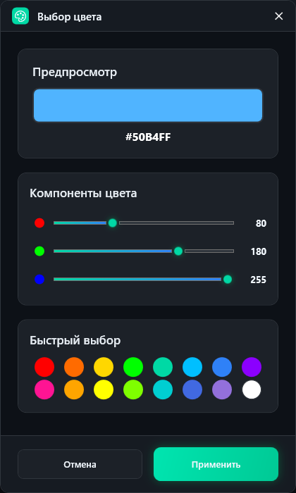

<div align="center">
  <h1>🧬 Cellverse — симуляция хаоса и эволюции</h1>
  <h3><i>Когда пиксели начинают жить своей жизнью (буквально)</i></h3>
  <p><b>Проект, где клетки рождаются, умирают, конкурируют — и всё это ради науки (и красоты).</b></p>
  
  
  
  
</div>

---

## ⚙️ О проекте

**Cellverse** — это не просто "игра Конвея". Это **движок** клеточных автоматов
с computer vision интеграцией, кастомными правилами и реал-тайм визуализацией.

**Здесь ты — бог маленькой вселенной:**
- 🎨 Импортируй изображения и превращай их в живые паттерны
- 🧬 Создавай свои типы клеток с уникальными правилами
- ⚡ Оптимизированный рендеринг (unsafe code + lookup tables)
- 🎬 Записывай эволюцию в MP4 через FFmpeg
- 📊 Отслеживай производительность в реальном времени

> 💡 *Клетки тут не просто живут — они конкурируют, мутируют и творят абсолютный хаос.*

---

## 🔥 Возможности

### 🎨 Визуализация
- **7 алгоритмов** обработки изображений (Canny, Sobel, Threshold...)
- **Цветовые схемы** — от классических до психоделических
- **Рендеринг по клеткам/пикселям** — выбирай производительность или детали
- **ColorPicker** — RGB слайдеры + 16 готовых палитр

### 🧬 Менеджер клеток
- Кастомные правила **рождения/выживания** (B/S нотация)
- **Множественные типы** с приоритетами
- **Конкуренция видов** — доминируй или вымирай

### ⚡ Производительность
- **Unsafe code** для критичных операций
- **Параллельная обработка** OpenCV

### 🎥 Экспорт
- **Видео запись** симуляции (FFmpeg)

> 🧪 *Каждая симуляция — это эксперимент. Иногда рождается хаос, иногда — идеальный порядок.*

---

## 📸 Галерея безумия

<div align="center">

### 🧬 Главное окно

<sub> <br> Когда у тебя 30 GPS, но тысячи клеток живут своей жизнью.</sub>

### 🎨 Импорт изображений
<table>
  <tr>
    <td></td>
    <td></td>
  </tr>
</table>
<sub>Загрузил Мону Лизу — получил армию клеточных зомби.</sub>

### 🔧 Менеджер клеток
 <br>
<sub>12 типов клеток. Каждая считает себя избранной.</sub>

### 🎨 ColorPicker
 <br>
<sub>Потому что клетки тоже хотят быть красивыми.</sub>

</div>

---

## 🚀 Быстрый старт

### Установка
```bash
# Клонируй репозиторий
git clone https://github.com/W1xon/Cellverse.git
cd Cellverse

# Собери проект
dotnet build

# Запусти симуляцию
dotnet run
```

### Системные требования
- **OS:** Windows 10+ 
- **.NET:** 8.0+
- **RAM:** 512MB минимум, 2GB рекомендуется
- **CPU:** Любой двухъядерный (чем мощнее — тем быстрее)

---

## 🛠️ Технологии

<div align="center">

| Компонент | Технология | Зачем |
|-----------|-----------|-------|
| **Framework** | .NET 9, C# 13 | Производительность + современный синтаксис |
| **UI** | WPF + MVVM | Красиво и поддерживаемо |
| **Computer Vision** | OpenCV.Sharp | Edge detection алгоритмы |
| **Video** | FFmpeg (Xabe) | Запись MP4 |
| **Rendering** | WriteableBitmap + Unsafe | Скорость рендера |
| **Architecture** | Lookup tables, Inline methods | 30x performance boost |
</div>

---
## 📊 Performance Metrics

| Parameter     | WinForms v0.1 | WPF v1.0.0 | WPF v1.1.0 | Δ / Comment |
|----------------|---------------|-------------|-------------|-------------|
| **FPS**        | 1 GPS         | 15 GPS      | 30 GPS 🚀   | **×30** speed boost |
| **RAM**        | N/A           | 1.5 GB      | 300 MB 💾   | **−80%** usage |
| **UI**         | Freezes ❄️    | Smooth 🙂    | Buttery ✨   | Responsiveness ↑∞ |
| **Rendering**  | Full ⚡        | Full ⚡      | Partial ⚡   | Optimized |
| **Features**   | Basic 🧩       | Advanced ⚙️  | Premium 🎨  | Added +++ |

---

**Легенда:**  
- **GPS:** Количество поколений в секунду (Generations Per Second)  
- **RAM:** Пиковое потребление памяти во время работы  
- **UI:** Отзывчивость интерфейса  
- **Rendering:** Тип отрисовки (Full = весь экран, Partial = только изменения)  
- **Features:** Уровень функциональности (Basic → Advanced → Premium)


**Секрет производительности:**
- Unsafe pointers для массивов
- Предвычисленные индексы соседей
- Частичный рендеринг (только изменённые клетки)
- Buffer.BlockCopy вместо циклов

---

## 👨‍💻 Автор

Создано **[Wixon Shade](https://github.com/W1xon)** —  
тем самым человеком, который решил, что пикселям тоже пора обрести смысл жизни (и оптимизацию памяти).

---

## ☕ Поддержка проекта

Если хочешь, чтобы клетки продолжали эволюционировать, а я — кодить без сна:

<div align="center">

[](https://dalink.to/w1xon)
[](https://youtube.com/@wixonshade)
[](https://t.me/wixonshade)

</div>

> 💰 Каждая кружка кофе = +1% к скорости эволюции клеток.

---

<div align="center">
  <sub>© 2025 Wixon Shade — Сделано с 🖤, кофе и легким безумием.</sub><br><br>
  
  <br><br>
  <i>"В начале был хаос. Потом появился код. Хаос остался."</i>
</div>