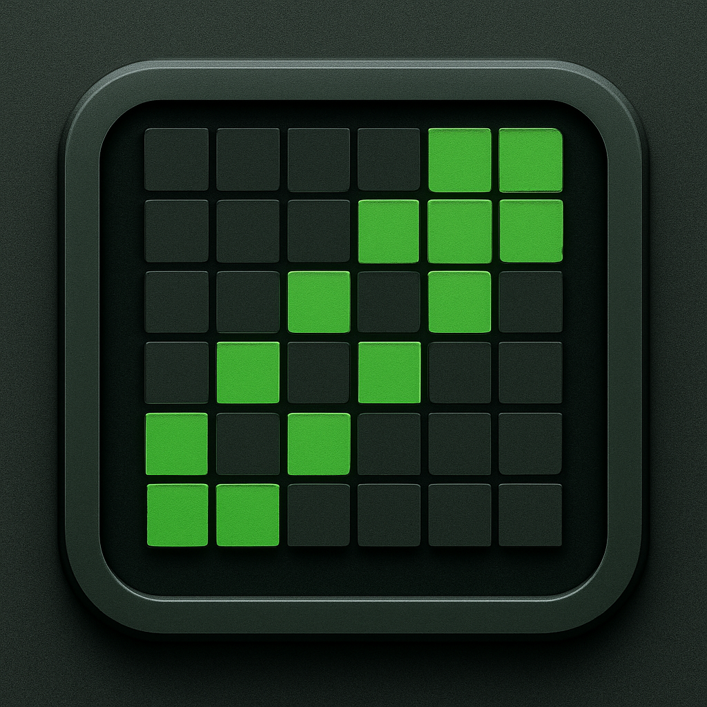
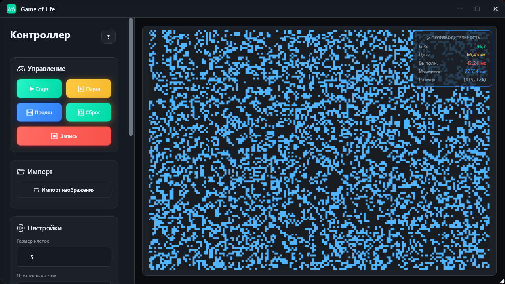
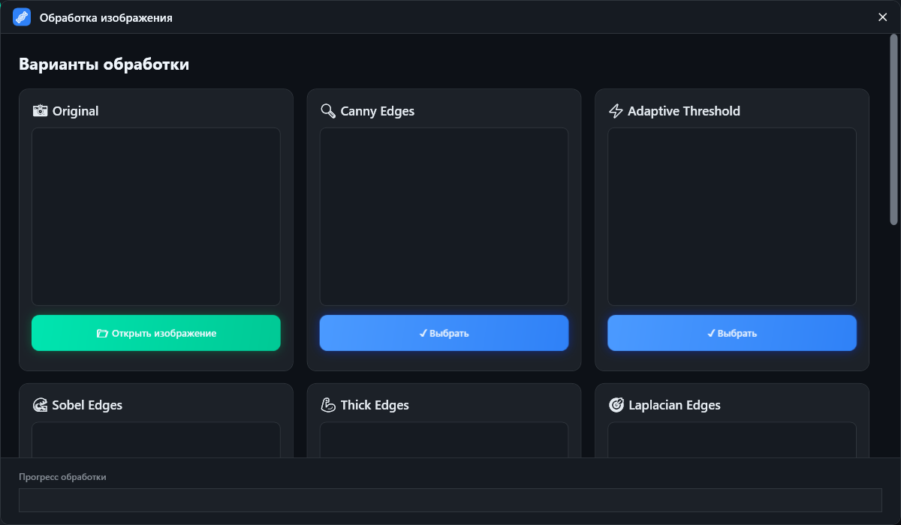
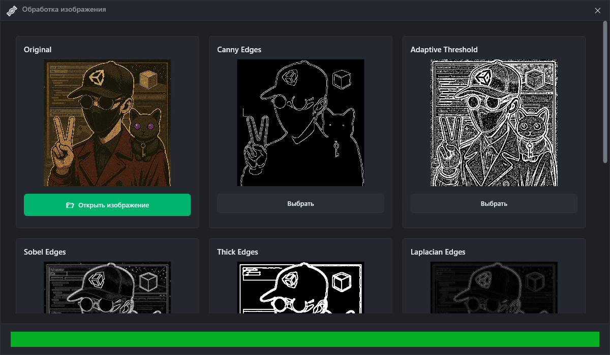
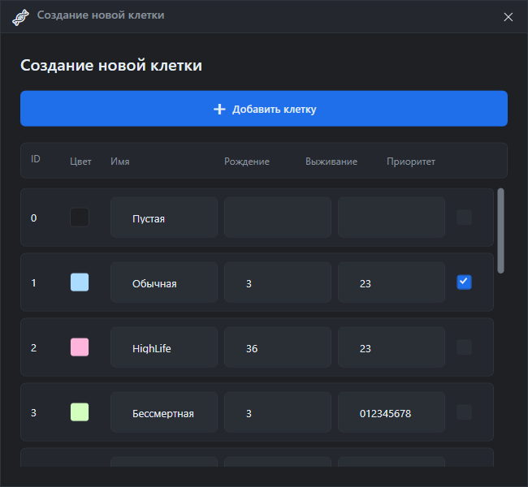

  <h1>🧬 Game of Life — симуляция хаоса и эволюции</h1>
  <h3><i>Когда пиксели начинают жить своей жизнью (буквально)</i></h3>
  
<b>Проект, где клетки рождаются, умирают, и всё это — ради науки (и красоты).</b>

  

---

## ⚙️ О проекте

**Game of Life** — это симулятор клеточного автомата, вдохновлённый классической идеей Конвея,
но переработанный с упором на **визуализацию**, **гибкость правил** и **эксперименты с типами клеток**.

Здесь ты не просто смотришь на жизнь — ты **управляешь законами мироздания**:
можешь создавать свои типы клеток, задавать их правила поведения, импортировать изображения и наблюдать,
как поле превращается в живую экосистему из сотен взаимодействующих организмов.

> 💡 *И да — клетки тут не просто живут и умирают. Они конкурируют, мутируют и творят беспорядок.*

---

## 🧩 Возможности

* 🎨 **Импорт изображений** — превращай любые картинки в стартовые состояния.
* 🧠 **Редактор правил клеток** — настрой собственные параметры выживания и рождения.
* 🌈 **Множество типов клеток** — с разными цветами, поведением и взаимодействием.
* ⚡ **Гибкая визуализация** — выбор между поклеточным и пиксельным рендерингом.
* 📊 **Мониторинг производительности** — FPS, время цикла, выполнение — всё под контролем.
* 🎥 **Запись симуляции в видео** — потому что некоторые миры заслуживают остаться в истории.

> 🧪 *Каждая симуляция — это маленькая вселенная. Иногда прекрасная, иногда катастрофическая.*

---

## 📸 Скриншоты

### 🧬 Главное окно

### 🎨 Импорт изображений

    
  

### 🔧 Менеджер клеток

    

Когда у тебя 12 типов клеток, и каждая хочет доминировать.

---

## 👨‍💻 Автор

Создано **Wixon Shade** —
тем самым человеком, который решил, что пикселям тоже пора обрести смысл жизни.

---

## ☕ Поддержка проекта

Если хочешь, чтобы клетки продолжали жить, а я — кодить без сна:

* 💰 [Donation Alerts](https://dalink.to/w1xon)
* ▶️ [YouTube](https://youtube.com/@wixonshade)
* 💬 [Telegram](https://t.me/wixonshade)

> Каждая кружка кофе = +1% эволюции клеток.

---

  © 2025 Wixon Shade — Сделано с 🖤, кофе и немного безумием. 
  

